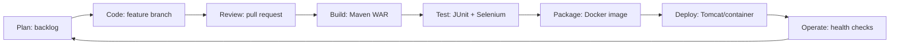

# Task 2 — Agile Planning and DevOps Workflow

## Product backlog

| Priority | Story | Acceptance criteria |
|---|---|---|
| P1 | As an admin, I can manage student and alumni profiles. | Create, list, edit, and search views persist valid records. |
| P1 | As a student, I can request mentorship from an alumnus. | A valid request is saved with status `REQUESTED`. |
| P1 | As an alumnus, I can accept or reject a request. | Only `REQUESTED` changes to `ACCEPTED` or `REJECTED`. |
| P1 | As an admin, I can complete accepted mentorships. | Only `ACCEPTED` changes to `COMPLETED`. |
| P1 | As an admin, I can see summary metrics. | Dashboard displays profile and request totals by status. |
| P2 | As a maintainer, I receive build feedback. | Maven tests run in Jenkins and a WAR is archived. |
| P2 | As a maintainer, I deploy a consistent image. | Versioned Docker image runs and exposes the app port. |
| P2 | As an operator, I can configure a target repeatedly. | Ansible check/apply are idempotent and expose a health check. |

## 15-task delivery board

| Task | Outcome | Sprint | State |
|---|---|---|---|
| 1 | Scope | 1 | done |
| 2 | Plan and workflow | 1 | done |
| 3 | Requirements and architecture | 1 | next |
| 4 | Repository baseline | 1 | next |
| 5 | First feature collaboration | 2 | planned |
| 6 | MVP completion and release baseline | 2 | planned |
| 7 | Jenkins CI job | 3 | planned |
| 8 | Pipeline and server deployment | 3 | planned |
| 9 | Selenium local tests | 4 | planned |
| 10 | Jenkins continuous testing | 4 | planned |
| 11 | Docker lifecycle | 5 | planned |
| 12 | Jenkins Docker CD | 5 | planned |
| 13 | Ansible configuration | 6 | planned |
| 14 | Provisioning reliability | 6 | planned |
| 15 | Release, report, and viva | 7 | planned |

## Definition of Done

A task is done when its requested source/configuration is present, reproduction steps are documented, automated checks feasible on the current environment have run with saved output, all task deliverables are checked in its README, and it has a meaningful Git commit pushed to `main`. Environment-dependent proof is explicitly marked `pending-manual`, never invented.

## DevOps lifecycle

## Deliverables checklist

- [x] User stories and acceptance criteria
- [x] Prioritized product backlog
- [x] 15-task delivery board and sprint sequence
- [x] Definition of Done
- [x] DevOps lifecycle diagram
