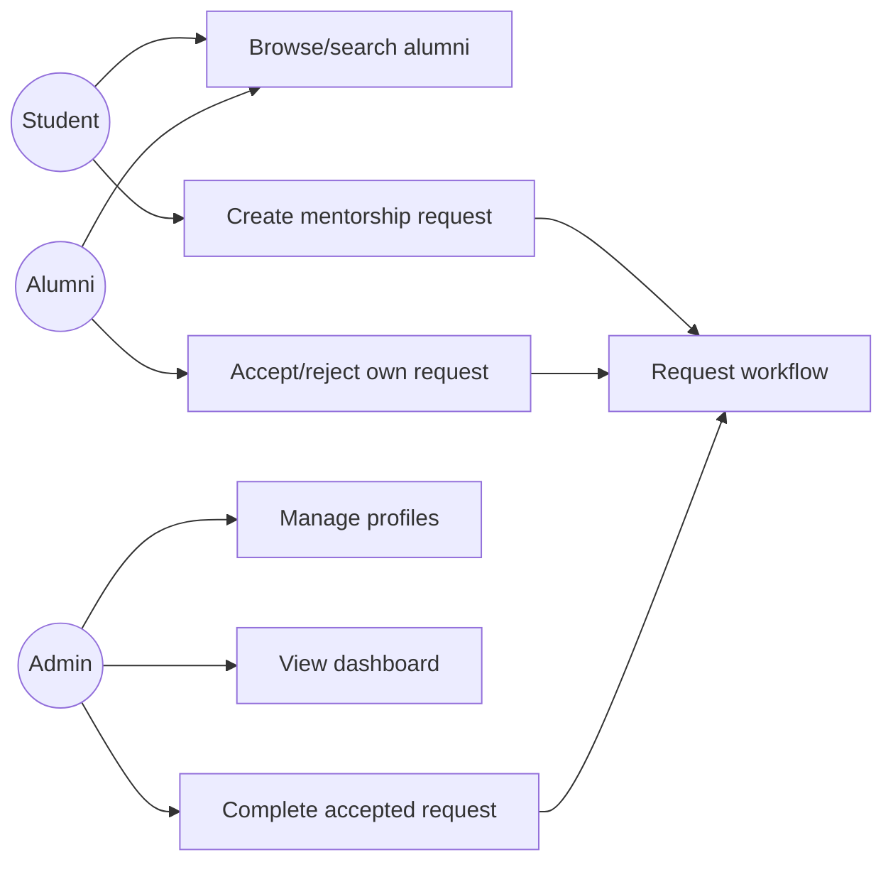
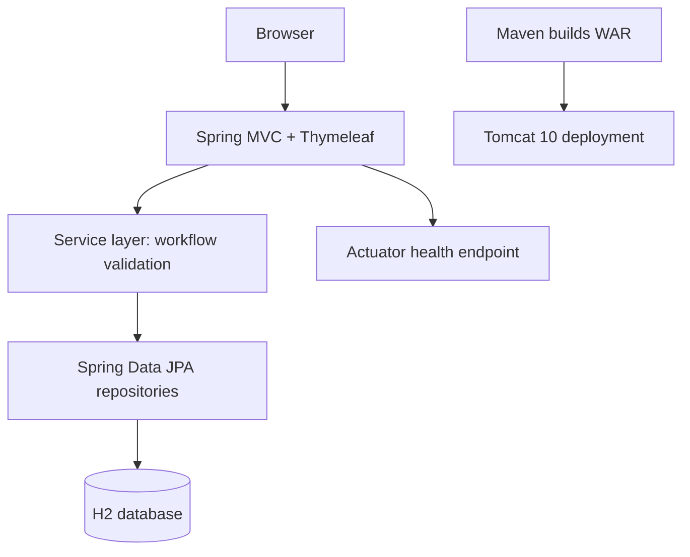

# Task 3 — Requirements, Architecture and Technology Setup

## SRS summary

The system shall manage students, alumni, and mentorship requests. It shall allow users to create, view, update, and search profiles; create requests; enforce role-aware request status changes; and show a dashboard summary. A request begins `REQUESTED`, an alumnus may make it `ACCEPTED` or `REJECTED`, and an administrator may make an accepted request `COMPLETED`.

## Use-case diagram

## Minimum architecture

## Technology and deployment choices

| Concern | Choice | Reason |
|---|---|---|
| Language/runtime | Java 17 | Course requirement; LTS baseline |
| Web framework | Spring Boot 3 + Thymeleaf | Fast server-rendered MVC MVP |
| Persistence | H2 + Spring Data JPA | Zero-setup local database |
| Build/test | Maven, JUnit 5 | Standard lifecycle and repeatable tests |
| UI testing | Selenium WebDriver | Required browser-journey coverage |
| Deployment target | Tomcat 10 (WAR) | Explicit course target; Docker alternative |
| Automation | Jenkins, Docker, Ansible | Required CI/CD and configuration path |

## Data model

| Entity | Key fields |
|---|---|
| Student | id, name, email, course, graduationYear |
| Alumni | id, name, email, company, expertise, graduationYear |
| MentorshipRequest | id, student, alumni, message, status, createdAt, updatedAt |

## Endpoint list

| Method/path | Purpose |
|---|---|
| `GET /` | Dashboard |
| `GET,POST /students` | List/create students |
| `GET,POST /alumni` | List/create alumni |
| `GET,POST /requests` | List/create requests |
| `POST /requests/{id}/status` | Apply role-aware status transition |
| `GET /api/health` | Simple deployment health response |
| `GET /actuator/health` | Spring Boot actuator health response |

## Local setup

1. Install JDK 17 and Maven 3.9+; set `JAVA_HOME` and ensure both are on `PATH`.
2. From `app`, run `mvn clean verify`.
3. Run `mvn spring-boot:run`; open `http://localhost:8080`.
4. Package with `mvn package`, then copy `target/alumni-mentorship.war` to Tomcat's `webapps/` directory.

## Environment inspection evidence

`task-3/evidence/environment-check.txt` records the actual availability check. This machine currently lacks Java and Maven on `PATH`, so the Maven setup validation is `pending-manual` until they are installed.

## Deliverables checklist

- [x] SRS summary
- [x] Use-case and architecture diagrams
- [x] Data model and endpoint list
- [x] Stack and deployment target selected
- [x] Local setup instructions
- [x] Actual environment check saved
- [ ] Working Maven local setup — pending-manual (install Java 17 and Maven)
